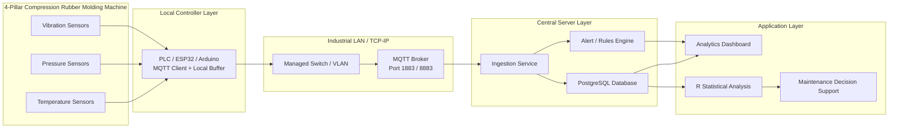
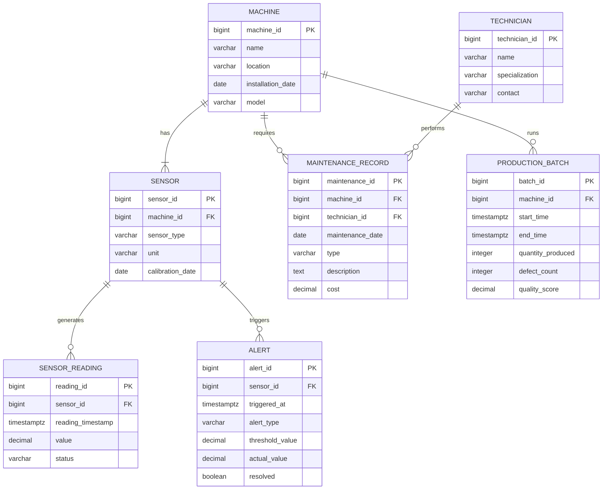

# Synapse 2026 Technical Report

## Project Title
Data-Driven Digital Transformation of an IoT-Enabled 4-Pillar Compression Type Rubber Molding Machine

## Assumptions
- All operational, maintenance, and quality data in this submission are simulated for academic use.
- The database is designed for a pilot fleet of 25 similar rubber molding machines so that the SQL deliverables contain at least 25 realistic records per main table. The target machine is one member of that fleet.
- The primary machine sensors are temperature, pressure, and vibration sensors connected to a PLC, ESP32, or Arduino-class edge controller.
- The local network is an industrial Ethernet LAN with an MQTT broker reachable over TCP/IP.
- PostgreSQL is used for the DBMS implementation, and the R analysis uses simulated data over a 30-day operating window.
- Security guidance aligns with IEC 62443 principles for industrial automation and control systems. Enterprise-to-shop-floor integration follows ISA-95 layering concepts.

## 1. CNDC: Communication, Networking and Data Communication

### 1.1 Industrial IoT Communication Architecture

The machine communication stack follows a five-layer Industrial IoT pattern:

1. Sensor layer
   Temperature sensors monitor mold and platen temperature, pressure sensors monitor hydraulic or compression pressure, and vibration sensors monitor motor, pump, or frame health.
2. Local controller layer
   A PLC or microcontroller collects raw analog or digital sensor values, timestamps them, adds sequence numbers and status codes, and publishes MQTT messages as a client.
3. Network layer
   The controller connects to an industrial LAN using Ethernet or industrial Wi-Fi. MQTT runs over TCP/IP so that messages are transported reliably to the broker.
4. Server layer
   A central server hosts the MQTT broker, ingestion service, database, and alert logic. It receives telemetry, validates payloads, stores records, and exposes data to analytics services.
5. Application layer
   A dashboard displays live trends, alarms, machine status, production KPIs, and maintenance recommendations.

### 1.2 Architecture Diagram Description

### 1.3 Suggested MQTT Topic Structure

- `factory/rubber_press/{machine_id}/temperature`
- `factory/rubber_press/{machine_id}/pressure`
- `factory/rubber_press/{machine_id}/vibration`
- `factory/rubber_press/{machine_id}/alerts`
- `factory/rubber_press/{machine_id}/status`

Payload fields should include:
- `machine_id`
- `sensor_id`
- `timestamp`
- `sequence_no`
- `sensor_type`
- `value`
- `unit`
- `status`
- `checksum`

### 1.4 Why MQTT over TCP Is Preferred

MQTT over TCP is well-suited to Industrial IoT because it is lightweight, stateful, and publish-subscribe oriented.

- Compared with HTTP:
  HTTP is request-response and typically more verbose because every transfer carries larger headers and repeated connection overhead. MQTT is better for continuous telemetry because the edge device publishes once to a broker and many subscribers can consume the data without re-polling the machine.
- Compared with raw TCP:
  Raw TCP gives transport reliability but no message topics, no retained messages, no QoS levels, no broker-based decoupling, and no standard industrial telemetry routing pattern. MQTT adds all of those features while still using TCP underneath.
- Industrial advantage:
  MQTT allows loose coupling between shop-floor assets and higher-level applications. The PLC only needs broker connectivity; dashboards, historians, and analytics engines can subscribe independently.

### 1.5 MQTT QoS Mapping for This Use Case

| QoS | Meaning | Best Use in This Machine |
| --- | --- | --- |
| 0 | At most once | High-frequency vibration trend data where occasional packet loss is acceptable because the next sample arrives quickly |
| 1 | At least once | Periodic temperature and pressure telemetry where duplicate messages can be tolerated and removed using `sequence_no` |
| 2 | Exactly once | Critical alarm notifications, remote parameter changes, or maintenance commands where duplication is unacceptable |

Recommended mapping:
- Temperature and pressure telemetry: QoS 1
- Routine vibration streaming: QoS 0
- Critical alerts and command messages: QoS 2

### 1.6 MQTT vs OPC UA vs Modbus for This Application

| Protocol | Strengths | Limitations | Fit for This Project |
| --- | --- | --- | --- |
| MQTT | Lightweight, efficient, publish-subscribe, cloud and analytics friendly, strong ecosystem | Requires broker, payload meaning must be defined by the application | Best primary telemetry protocol for sensor streaming and dashboard integration |
| OPC UA | Rich information model, strong interoperability, industrial semantics, built-in security options | Heavier stack, more configuration effort, higher complexity on small microcontrollers | Strong choice if the project expands to enterprise MES/SCADA interoperability |
| Modbus RTU/TCP | Simple, widely supported, easy for register-based polling | Polling-oriented, weak semantics, limited security, not natively publish-subscribe | Good for device-to-controller acquisition, but less suitable than MQTT for server-side streaming analytics |

Best design for the pilot:
- Use Modbus at the machine or sensor acquisition side if existing hardware already exposes it.
- Use MQTT over TCP/IP for controller-to-server telemetry.
- Add OPC UA later if broader plant interoperability is required.

### 1.7 Reliability, Data Integrity and Fault Tolerance

#### Client buffering strategy

When network connectivity is unavailable, the PLC or edge controller should switch from online publish mode to store-and-forward mode:

- Continue sampling locally at the configured interval.
- Write unsent records into a ring buffer in non-volatile memory, SQLite, FRAM, or SD storage.
- Mark buffered records with `status = BUFFERED`.
- Retry broker connection using exponential backoff.
- On reconnection, publish buffered records in timestamp order before resuming normal live streaming.

If the buffer approaches capacity:
- Keep critical alarms and threshold violations at highest priority.
- Down-sample non-critical vibration telemetry.
- Raise a local HMI or stack-light warning that remote visibility has been lost.

#### Data integrity mechanisms

- Sequence numbers:
  Each controller increments a per-sensor or per-machine `sequence_no` so the server can detect duplicates, gaps, or out-of-order messages.
- Checksums or hashes:
  Each payload includes a checksum or digest for application-layer validation.
- Timestamps:
  Use NTP-synchronized timestamps so server ordering and time-series analysis remain consistent.
- MQTT acknowledgments:
  QoS 1 and QoS 2 provide broker-level acknowledgment. Server ingestion should still apply idempotency checks on `(sensor_id, sequence_no)`.
- Database constraints:
  Unique constraints on `(sensor_id, sequence_no)` or `(sensor_id, timestamp)` prevent double insertion.

#### Security controls

Recommended controls aligned to IEC 62443 defense-in-depth principles:

- TLS 1.2 or TLS 1.3 for MQTT over port 8883
- Broker authentication using usernames, strong passwords, and ideally client certificates
- Role-based access control so publishers and subscribers only access allowed topics
- Network segmentation between OT, industrial DMZ, and IT analytics zones
- Encrypted data in transit and strict firewall allowlists
- Security logging for failed logins, topic authorization failures, and abnormal reconnect behavior

#### What happens if the PLC loses connectivity to the broker

Expected behavior:

1. The PLC detects connection failure through keep-alive timeout or publish failure.
2. New sensor readings are buffered locally with timestamps and sequence numbers.
3. Local machine control continues because the molding process must not depend on the remote server.
4. Local alarms can still be shown on an HMI, buzzer, or tower light.
5. The controller retries the broker connection.
6. After reconnection, buffered data are flushed in order, and duplicates are rejected by the server using keys and checksums.
7. If outage duration exceeds buffer capacity, the controller should preserve alarm and fault records first, then summarize lower-priority data.

This is a classic fail-operational OT design: process control remains local, while remote monitoring degrades gracefully.

### 1.8 LAN and WAN Design Considerations

#### Static IP assignment

Use static IPs or DHCP reservations for deterministic industrial connectivity:

- PLC or edge controller: static IP
- MQTT broker: static IP
- Database server: static IP
- Dashboard server: static IP or reserved address

Benefits:
- Easier firewall rules
- Easier broker ACL configuration
- More reliable maintenance and troubleshooting

#### Port configuration

- MQTT insecure testing only: `1883/TCP`
- MQTT over TLS: `8883/TCP`
- PostgreSQL inside the secure server zone only: `5432/TCP`
- Dashboard or API ports only where needed and restricted by source network

#### Firewall and DMZ guidance

Recommended zoning:

- OT zone:
  PLC, local HMI, switch, sensors
- Industrial DMZ:
  MQTT broker bridge, historian replica, reverse proxy, jump host
- IT or analytics zone:
  Database replicas, BI dashboard, R analytics workstation

Security rules:
- Do not expose PLCs directly to the public internet.
- Permit only required outbound controller traffic to the broker.
- Permit only broker-to-ingestion and ingestion-to-database flows.
- Use jump hosts and VPN for remote engineering access.
- Log and review inter-zone traffic.

This architecture is consistent with ISA-95 layered integration and IEC 62443 segmentation practice.

## 2. DBMS: Relational Database Design

### 2.1 ER Diagram Description

Entities and attributes:

1. Machine
   - `machine_id` (PK)
   - `name`
   - `location`
   - `installation_date`
   - `model`

2. Sensor
   - `sensor_id` (PK)
   - `machine_id` (FK to Machine)
   - `sensor_type`
   - `unit`
   - `calibration_date`

3. SensorReading
   - `reading_id` (PK)
   - `sensor_id` (FK to Sensor)
   - `timestamp`
   - `value`
   - `status`

4. MaintenanceRecord
   - `maintenance_id` (PK)
   - `machine_id` (FK to Machine)
   - `technician_id` (FK to Technician)
   - `date`
   - `type`
   - `description`
   - `cost`

5. Technician
   - `technician_id` (PK)
   - `name`
   - `specialization`
   - `contact`

6. ProductionBatch
   - `batch_id` (PK)
   - `machine_id` (FK to Machine)
   - `start_time`
   - `end_time`
   - `quantity_produced`
   - `defect_count`
   - `quality_score`

7. Alert
   - `alert_id` (PK)
   - `sensor_id` (FK to Sensor)
   - `triggered_at`
   - `alert_type`
   - `threshold_value`
   - `actual_value`
   - `resolved`

### 2.2 Structural Constraints

| Relationship | Structural Constraint | Interpretation |
| --- | --- | --- |
| Machine to Sensor | `(1,1)` to `(1,N)` | Every machine has at least one sensor, and each sensor belongs to exactly one machine |
| Sensor to SensorReading | `(1,1)` to `(0,N)` | A sensor may have zero or many readings, and each reading belongs to one sensor |
| Machine to MaintenanceRecord | `(1,1)` to `(0,N)` | A machine may have zero or many maintenance records, and each record belongs to one machine |
| Machine to ProductionBatch | `(1,1)` to `(0,N)` | A machine may have zero or many production batches, and each batch belongs to one machine |
| Technician to MaintenanceRecord | `(1,1)` to `(0,N)` | A technician may perform zero or many maintenance activities, and each record references one technician |
| Sensor to Alert | `(1,1)` to `(0,N)` | A sensor may generate zero or many alerts, and each alert is tied to one sensor |

### 2.3 Why SensorReading Is a Weak Entity

`SensorReading` is weak in the conceptual sense because it has no operational meaning without its parent `Sensor`.

- A reading cannot exist unless the corresponding sensor exists.
- The lifecycle of a reading depends entirely on the sensor.
- In business terms, a reading is identified by the owning sensor plus a time or sequence position.

In the physical PostgreSQL model, a surrogate `reading_id` is added for query performance and easier referencing by alerts, but the entity is still existence-dependent on `Sensor`.

### 2.4 ER Diagram

### 2.5 SQL Implementation

The executable PostgreSQL deliverable is provided in:

- [synapse2026_postgres.sql](/C:/rubber/deliverables/synapse2026_postgres.sql)

That script includes:
- Full DDL with keys, `NOT NULL`, `UNIQUE`, `CHECK`, and foreign keys
- DML seeding for at least 25 records per main table
- Indexes for time-series performance
- Views for live status and machine health
- Trigger-based alert creation
- A stored procedure for maintenance due reporting
- Example queries covering joins, aggregation, views, and nested subqueries

## 3. Inferential Statistics in R

### 3.1 Statistical Objective

The goal of the R analysis is to convert stored telemetry into operational insight:

- Describe the process behavior statistically
- Test hypotheses about process stability and shifts
- Model quality and defect relationships
- Detect anomalies for predictive maintenance
- Estimate reliability from maintenance or failure intervals

### 3.2 Analysis Design

The R script simulates 720 hourly observations over 30 days and includes:

- Temperature centered near the process target of 180 degC
- Pressure varying by cycle state: pre-heat, compression, cooling
- Vibration values with occasional spikes to mimic bearing, pump, or alignment issues
- Quality score linked to temperature stability
- Defect count linked to temperature deviation, pressure deviation, and vibration

### 3.3 Statistical Methods Covered

1. Descriptive statistics
   - Mean, median, standard deviation, and IQR for temperature, pressure, and vibration
   - Histograms and boxplots for each sensor type

2. Hypothesis testing
   - One-sample t-test for mean temperature versus the 180 degC target
   - Two-sample t-test comparing morning and afternoon temperature
   - ANOVA for pressure across pre-heat, compression, and cooling cycles

3. Regression
   - Simple linear regression: `quality_score ~ temperature`
   - Multiple regression: `defect_count ~ temperature + pressure + vibration`

4. Statistical process control
   - X-bar and R charts for subgrouped temperature readings
   - Out-of-control point detection using standard control chart constants

5. Reliability analysis
   - Simulation of time-between-failure intervals
   - Exponential and Weibull distribution fitting
   - IFR interpretation using the Weibull shape parameter

6. Anomaly detection
   - Z-score method using the `±3 SD` rule
   - Time-series visualization of flagged anomalies

### 3.4 R Deliverable

The fully commented and reproducible R script is provided in:

- [synapse2026_statistics.R](/C:/rubber/deliverables/synapse2026_statistics.R)

## 4. Unified CNDC -> DBMS -> Statistics Pipeline

The full project works as one data pipeline:

1. Sensors measure mold temperature, compression pressure, and machine vibration.
2. The PLC or edge controller packages readings with timestamps, sequence numbers, and status flags.
3. MQTT over TCP/IP carries telemetry from the machine to the central broker.
4. The ingestion service validates and stores messages in PostgreSQL.
5. Database views, alerts, and procedures organize live monitoring and maintenance history.
6. R reads the stored data or an exported dataset for descriptive analysis, hypothesis testing, regression, SPC, reliability, and anomaly detection.
7. Statistical outputs support maintenance decisions, process optimization, and energy or quality improvements.

This creates a closed-loop digital transformation path:

Sensor read -> MQTT publish -> database storage -> statistical analysis -> actionable maintenance and quality decisions

## 5. Ethical and Responsible Use Considerations

### 5.1 Data privacy and access control

- Restrict dashboard, database, and broker access using least privilege.
- Log access to sensitive production and maintenance records.
- Separate worker identity data from machine telemetry where possible.

### 5.2 Responsible predictive maintenance

- Predictive outputs should support technicians, not automatically penalize operators.
- Human validation is required before shutdown or disciplinary decisions are made from model outputs.
- False positives and false negatives should be communicated clearly to maintenance staff.

### 5.3 Safety and transparency

- Analytics must not override safety interlocks or emergency stop logic.
- Any recommended maintenance action should be explainable with supporting sensor evidence.
- Model thresholds should be reviewed periodically to avoid drift and unsafe overconfidence.

## 6. Submission Checklist

- [x] IoT communication framework diagram and explanation
- [x] Network reliability and fault-tolerance write-up
- [x] ER diagram with entities, attributes, and structural constraints
- [x] SQL DDL and DML implementation
- [x] SQL queries with joins, aggregation, views, trigger, index, and stored procedure
- [x] R script for simulation, statistics, regression, SPC, reliability, and anomaly detection
- [x] Final integrated technical report narrative

## 7. Standards Referenced

- IEC 62443: Industrial communication networks and system security guidance for segmentation, authentication, and defense-in-depth
- ISA-95: Enterprise-control system integration framework for aligning shop-floor assets with information systems
